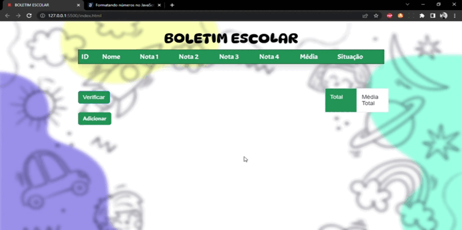

<h1 align="center"> Boletim Escolar </h1>

:pushpin: Projeto acadêmico realizado com o intuito de colocar em prática os primeiros aprendizados em Javascript.

## 🛠️ Stacks e conhecimentos utilizados

    
<b>HTML</b>

     

    - Uso de tags semânticas, como HEADER, SECTIO e FOOTER;
    - Framework Bootstrap

    
<b>CSS</b>

     

    - CSS Grid e Flexbox para posicionamento de itens e criação do layout.
    - Bootstrap e estilização da página.

    
<b>Javascript</b>

     
    - Criação de função para realizar o cálculo das notas;
    - Função de atulizar a lista de cadastro;
    - Função de adicionar alunos;
    - Uso de função anônima;

## :triangular_flag_on_post: Á Melhorar
<b>
    - Reduzir a quantidade de variáveis no js.  
    - Inserir a caixar de 'Search' na lista.  
    - Botão de excluir.  
    - Melhorar o uso do bootstrap.  
</b>

